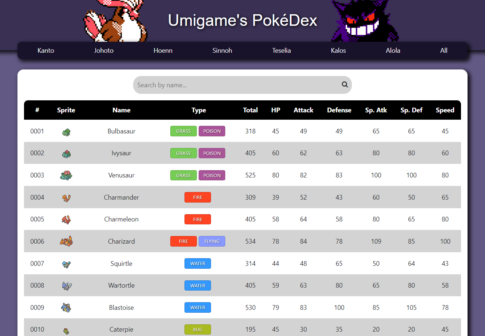

# Umigame's Pokémon Database

> Basic Pokédex made with HTML, JavaScript and CSS.

## Introduction

Welcome to my Pokémon Database. I made this Pokédex mainly to learn more about API calls and how to implement those in JavaScript using Fetch API. All the data is extracted from an API called PokéAPI.

In addition to that, I'm making this little project to get knowledge about structuring HTML pages and improving them with CSS. I implemented Bootstrap to familiarize with this framework.

## Features

This is a basic PokéDex that shows basic information about all the Pokémons until generation 5. It displays diferents parameters of each Pokémon such as the Name, Type, Total Stats, HP, Attack, Defense, Special Attack, Special Defense and Speed.

Link: https://umigam3.github.io/pokedex-api/

